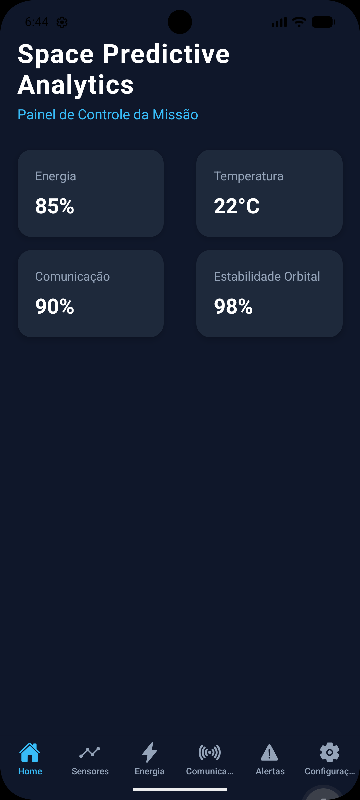
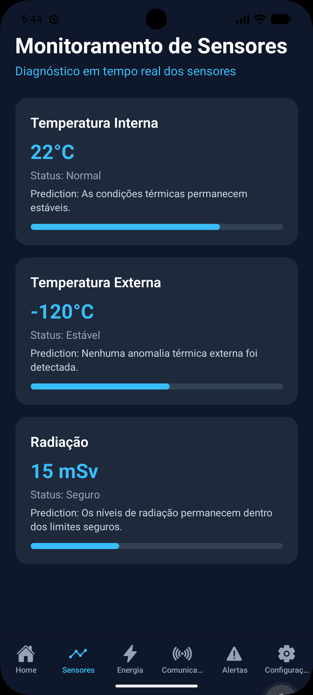
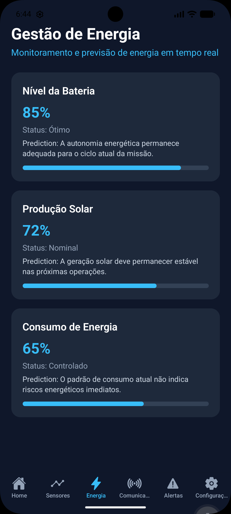
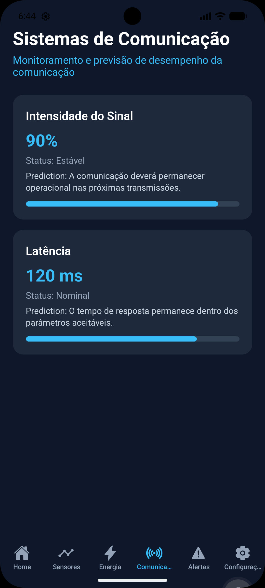
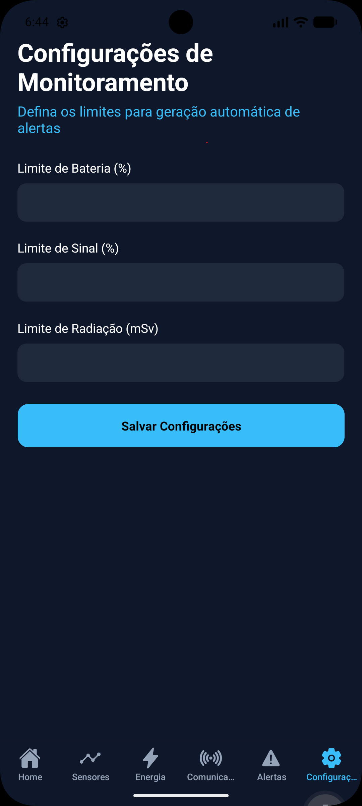

# Space Predictive Analytics

### Global Solution 2026.1 — Cross-Platform Application Development | FIAP

## Sobre o Projeto

O projeto **Space Predictive Analytics** foi desenvolvido para a Global Solution da disciplina **Cross-Platform Application Development (CPAD)**.

A aplicação simula uma plataforma inteligente de monitoramento e análise preditiva para missões espaciais, permitindo acompanhar indicadores operacionais em tempo real relacionados à energia, sensores, comunicação e estabilidade orbital.

A solução auxilia na identificação de riscos, geração de alertas automáticos e apoio à tomada de decisão em ambientes críticos, simulando conceitos utilizados em operações aeroespaciais modernas.

---

## Objetivos

* Monitorar dados críticos de uma missão espacial.
* Exibir informações em tempo real por meio de dashboards intuitivos.
* Gerar alertas automáticos para situações críticas.
* Permitir a configuração personalizada de limites operacionais.
* Simular conceitos de análise preditiva aplicados ao contexto espacial.
* Demonstrar persistência de dados utilizando armazenamento local.

---

## Tecnologias Utilizadas

* React Native
* Expo
* Expo Router
* TypeScript
* Context API
* AsyncStorage
* React Native Web

---

## Funcionalidades Implementadas

### Dashboard Principal

* Visualização geral da missão.
* Indicadores de energia.
* Temperatura interna.
* Comunicação.
* Estabilidade orbital.

### Monitoramento de Sensores

* Temperatura interna.
* Temperatura externa.
* Nível de radiação.
* Status operacional dos sensores.
* Análise preditiva dos dados monitorados.

### Gestão de Energia

* Nível da bateria.
* Produção solar.
* Consumo de energia.
* Indicadores preditivos de desempenho energético.

### Sistemas de Comunicação

* Intensidade do sinal.
* Latência.
* Status da comunicação.
* Previsão de desempenho da transmissão.

### Sistema de Alertas

* Monitoramento automático dos indicadores.
* Alertas de bateria.
* Alertas de sinal.
* Alertas de radiação.
* Alertas de estabilidade orbital.
* Recomendações para tomada de decisão.

### Configurações

* Definição de limites personalizados.
* Persistência de dados utilizando AsyncStorage.
* Recuperação automática das configurações salvas.

---

## Vídeo Demonstrativo

Vídeo de apresentação do projeto:

https://youtube.com/shorts/8lCEsnv5H8A?feature=share

---

## Telas do Sistema

### Dashboard Principal



### Monitoramento de Sensores



### Gestão de Energia



### Sistemas de Comunicação



### Sistema de Alertas


### Configurações



---

## Estrutura do Projeto

```text
app
├── (tabs)
│   ├── index.tsx
│   ├── sensores.tsx
│   ├── energia.tsx
│   ├── comunicacao.tsx
│   ├── alertas.tsx
│   └── configuracoes.tsx
│
├── _layout.tsx
│
components
├── InfoCard.tsx
└── SensorCard.tsx
│
context
└── MissionContext.tsx
│
types
└── mission.ts
```

---

## ▶Como Executar o Projeto

### Clonar o repositório

```bash
git clone https://github.com/gipraieiro/global-solution-cpad.git
```

### Instalar as dependências

```bash
npm install
```

### Executar o projeto

```bash
npx expo start
```

---

## Integrantes

| Nome                                 | RM     |
| ------------------------------------ | ------ |
| Maria Eduarda de Oliveira Silva Luiz | 565386 |
| Giovanna Praieiro Pavani             | 565681 |

---

## Disciplina

**Cross-Platform Application Development (CPAD)**

---

## Repositório

https://github.com/gipraieiro/global-solution-cpad

---

## Status do Projeto

* Projeto desenvolvido
* Interface funcional
* Navegação entre telas
* Monitoramento de sensores
* Gestão de energia
* Sistema de comunicação
* Sistema de alertas
* Configurações persistentes
* Análise preditiva simulada
* Documentação concluída